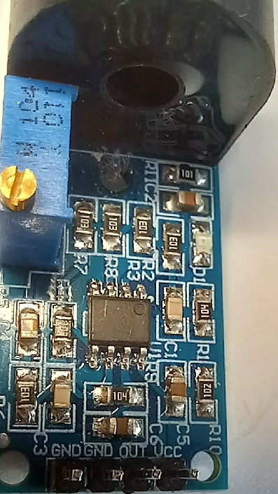
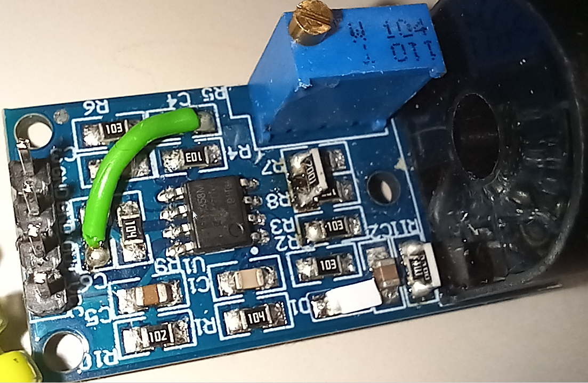
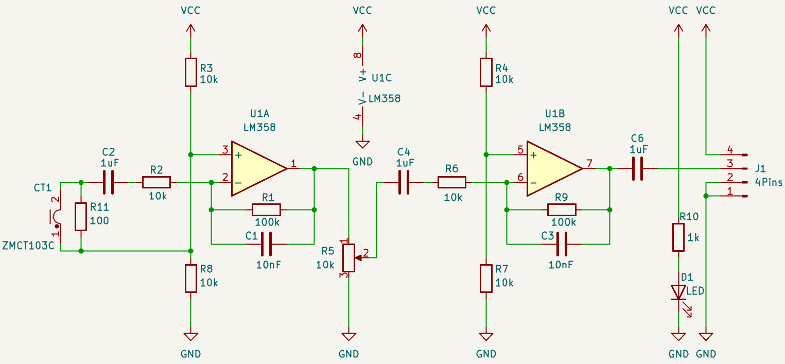
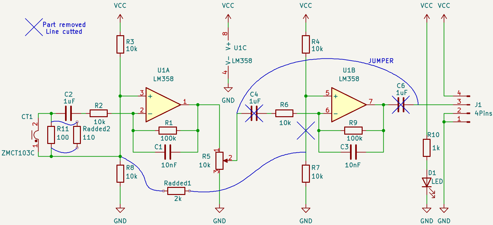

# Current sensing by a modified ZMCT103C module

Original PCB

    

Modified PCB

    

Original schematic

    

Modified schematic

    

  ZMCT103C datasheet [ZMCT103C datasheet](https://5nrorwxhmqqijik.leadongcdn.com/ZMCT103C+specification-aidirBqoKomRilSjpimnokp.pdf)

  ### Az Ebay-en vásárolt áramérzékelő modult felhasználás előtt kicsit elemeztem. 

A vásárlásnál a leírásra hagyatkoztam és utólag látszik, a megnevezésben az 5A túlzás. Mivel a modul ára alacsony sokáig nem gondolkoztam rajta, hogy vásároljak-e belőle. Felhasználáskor viszont szerettem volna látni, milyen működésre számíthatok.

Példának egy ilyen modul:

https://www.ebay.com/itm/236746382331

A megnevezés szerint 5A-ig kellene áramot mérnie. A valóságban azonban meg sem közelíti ezt az értéket. 

### A modult módosítás nélkül arduino projektben árammérésre használni értelmetlen. 

Ennek az az oka, hogy a kimeneti ponton egy kondenzátoros csatolás található. Ez megakadályozza a DC jel áthaladását. Így tehát nincs feszültség offszet, ami a kapcsolásból kijövő jelet (ADC-be bemenő jelet) a pozitív tartományba helyezné. Az ADC 0V alatti értékekre azonos választ ad, azaz nulla. Levágja a jelből a negatív értékeket. Ami megmarad egy szinusz hullámból, az a pozitív oldal. 

###  Az alkalmazott műveleti erősítő nem tudja a kimenetét a pozitív tápfeszültségig eltolni. 

Az adatlapja szerint a tápfeszültség alatt marad nagyjából 1,5V-tal a maximális kimeneti érték. Ha a panelt megtápláljuk Vcc=5V-tal, akkor a kimeneten a pozitív csúcsok mértéke: (Vcc - 1,5V) - Vcc/2 = Vcc/2 - 1,5V = 1V. A lehetséges maximális kimeneti érték tehát 1V. A kondenzátoros csatolás miatt ettől kissé nagyobb lesz, mivel a feszültség mértéke a műveleti erősítő kimenetén lefelé a 2,5V tartományban van. ( Csúcstól csúcsig ) / 2. ADC szempontjából ez azt jelenti, hogy a maximális érték kb. 1,75 x 1023 / 5V = 358. Ha az arduino (UNO,nano) analog bemenetén nincs felhúzó vagy lehúzó ellenállás, akkor zavarforrások ezt még befolyásolhatják.

### Az első fokozat telítésbe megy 1A áram esetén.

Az áramváltó 1:1000 áttételű ( névleges kimeneti áram 5mA -> 5A hatására ). Az első fokozat erősítése: 100k/10k = 10. A fenti 1V kimenet 100mV bemenetnél adódik (e fölött már vágja a jelet a kapcsolás). 100ohm bemeneti ellenálláson 1mA áram hatására 100mV feszültség adódik. Innen következik, hogy az áramváltón 1A-nél nagyobb áramok esetében az áramkör telítődik, torzított jelet ad a kimenetén. 

